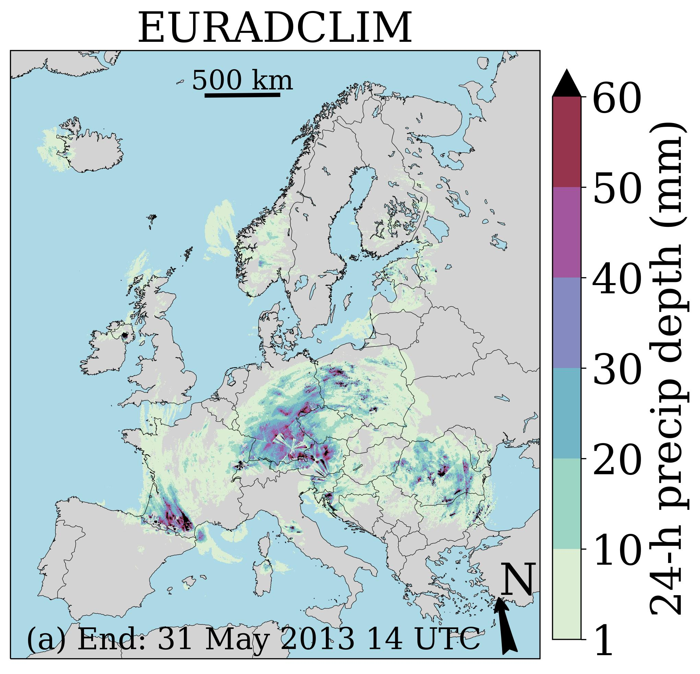

# EURADCLIM-tools

# Introduction
EURADCLIM (EUropean RADar CLIMatology) is a publicly available climatological dataset of 1-h and 24-h precipitation accumulations on a 2-km grid for the period 2013 through 2020. The starting point is the European Meteorological Network (EUMETNET) Operational Program on the Exchange of weather RAdar Information (OPERA) gridded radar dataset of 15-min instantaneous surface rain rates, which is based on data from, on average, 138 ground-based weather radars. After additional removal of non-meteorological echoes by three algorithms, this dataset is merged with precipitation accumulations from potentially ~7700 rain gauges obtained from the European Climate Assessment & Dataset (ECA&D). EURADCLIM covers about 78% of geographical Europe.

# Tools
The following tools, written in programming language Python (version 3), are made available in EURADCLIM-tools:
- "AccumulateRadarHDF5ODIMListCount.py": Script to accumulate ODIM HDF5 radar precipitation images where the file names are provided as input or to accumulate ODIM HDF5 radar precipitation images for a given path.
- "ClimatologyRadarHDF5ODIMList.py": Script to perform climatological analysis on ODIM HDF5 radar precipitation images where the file names are provided as input or for a given path. The maximum rainfall, mean rainfall, number of events (= frequency) above a threshold value, or number of events above a threshold value divided by the total number of events (= relative frequency) can be computed.
- "VisualizeHDF5ODIMCartopy.py": Script to visualize ODIM HDF5 images (data at a 2-D grid) over Europe.
- "VisualizeHDF5ODIMCartopyOSM_GM.py": Script to visualize ODIM HDF5 images (data at a 2-D grid) over Europe. Draws an OpenStreetMap or Google Maps as background. Useful when zooming in on a part of Europe.

# Details
Information on usage of these tools is provided in the respective Python script.

The provided tools have been tested with the following OPERA composite products:
- Instantaneous Surface Rain Rate
- 1 Hour Rainfall Accumulation

They have also been tested with the 1-h and 24-h precipitation accumulations in EURADCLIM. Note that all these datasets are in the ODIM-HDF5 format on the default OPERA grid of 2 km resolution (Lambert Azimuthal Equal Area projection; 2200 times 1900 grid cells).

Note that some Python libraries need to be installed for these tools to work, but they are not all needed for every tool: cartopy, copy, h5py, matplotlib, natsort, numpy, os, pandas, pyepsg, pyproj, shutil, sys, warnings.

The file "CoordinatesHDF5ODIMWGS84.dat" is needed for the two visualization tools. It contains the coordinates of the center of radar grid cells with longitude (first column) and latitude (second column) in degrees (WGS84). This may also be useful for processing the EURADCLIM radar data for analyses and applications or for other visualization tools.

The file "RAD_OPERA_RAINFALL_RATE_201812110715.h5" is used as a template ODIM-HDF5 file and only needed for tools "AccumulateRadarHDF5ODIMListCount.py" & "ClimatologyRadarHDF5ODIMList.py".

# EURADCLIM datasets
The EURADCLIM datasets of 1-h and 24-h precipitation accumulations are publicly available here: https://doi.org/10.21944/7ypj-wn68 & https://doi.org/10.21944/1a54-gg96.
URL to accompanying scientific manuscript will be added soon.

# Usage - Example for "VisualizeHDF5ODIMCartopy.py"
```
python VisualizeHDF5ODIMCartopy.py RAD_OPERA_24H_RAINFALL_ACCUMULATION_201305311400.h5 RAD_OPERA_24H_RAINFALL_ACCUMULATION_201305311400_EURADCLIM.jpg 'EURADCLIM' '24-h precip depth (mm)' CbF '[1,10,20,30,40,50,60]' DrawCountries DrawCoastlines DrawLakelines DoNotColorSetUnder ColorBar '(a) End: 31 May 2013 14 UTC' lightgray lightblue 300 24 29 31 21 NA NA NA DrawNorthArrow DrawScaleBar '/dataset1'
```

